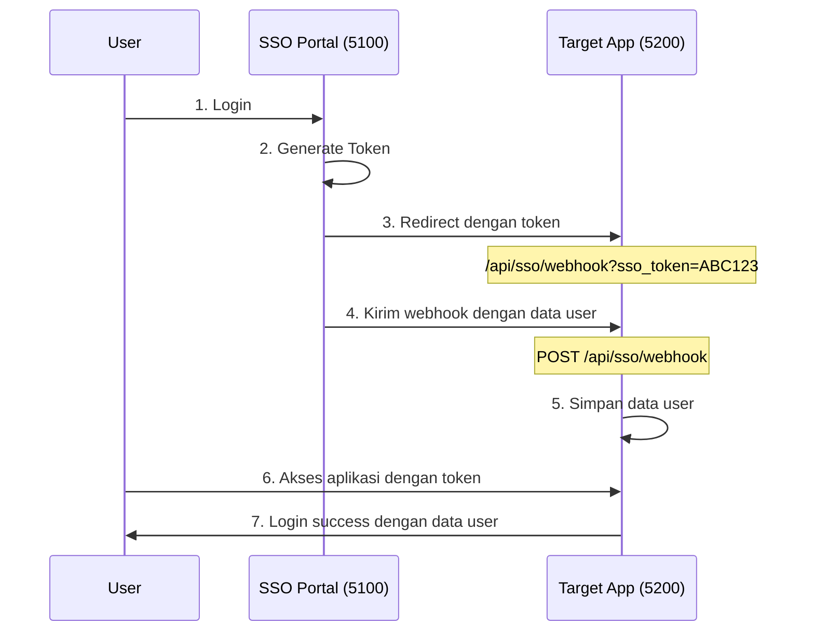

# 🔐 SSO Portal Integration Guide

Panduan lengkap untuk mengintegrasikan aplikasi target dengan SSO Portal.

## 📋 Daftar Isi

- [1. Tentang Token SSO](#1-tentang-token-sso)
- [2. Cara Mendapat Data User](#2-cara-mendapat-data-user)
- [3. Flow Integrasi](#3-flow-integrasi)
- [4. Implementasi Code](#4-implementasi-code)
- [5. Konfigurasi](#5-konfigurasi)
- [6. Testing](#6-testing)
- [7. Checklist](#7-checklist)

---

## 🔑 1. Tentang Token SSO

### Token SSO adalah:
- **Random string** sepanjang 64 karakter (Base64 encoded)
- **BUKAN JWT** - tidak bisa di-decode
- Berlaku selama **8 jam**
- Contoh: `_AMDtu2s6sen4kBXYFbq07OL8ZGDU-QPyKLQvONOSXSNYOFPFuC4ZOwv2oD37U6TbX1Cd3g7X7Q-tFgTCk0oMw`

> ⚠️ **PENTING**: Token hanya sebagai **reference key**, bukan container data user!

---

## 📡 2. Cara Mendapat Data User

Ada 2 metode untuk mendapat data user dari token:

### 🎯 **Metode A: Webhook (RECOMMENDED)**

**Setup:**
1. Daftarkan aplikasi dengan `webhook_url` dan `webhook_secret`
2. SSO Portal otomatis kirim data user saat token dibuat

**Request yang Diterima:**
```http
POST /api/sso/webhook
Content-Type: application/json

{
  "event": "token.created",
  "timestamp": "2025-10-09T10:30:00Z",
  "data": {
    "token": "_AMDtu2s6sen4kBXYFbq07OL8ZGDU-QPyKLQvONOSXSNYOFPFuC4ZOwv2oD37U6TbX1Cd3g7X7Q-tFgTCk0oMw",
    "user": {
      "id": "3",
      "username": "mike.wilson",
      "email": "mike.wilson@eaglehigh.com",
      "name": "Mike Wilson",
      "role": "User"
    },
    "expires_at": "2025-10-09T18:30:00Z"
  }
}
```

### 🔄 **Metode B: Validation API (Fallback)**

**Endpoint:**
```http
GET http://localhost:5100/validate-token?token={TOKEN}
```

**Response Success:**
```json
{
  "valid": true,
  "user": {
    "id": "3",
    "username": "mike.wilson",
    "email": "mike.wilson@eaglehigh.com",
    "name": "Mike Wilson",
    "role": "User"
  },
  "expires_at": "2025-10-09T18:30:00Z"
}
```

**Response Failed:**
```json
{
  "valid": false,
  "error": "Token expired atau invalid"
}
```

---

## 🔄 3. Flow Integrasi



**Step by Step:**
1. User login di SSO Portal (`localhost:5100`)
2. SSO Portal buat token dan redirect ke aplikasi target
3. URL redirect: `http://your-app.com/api/sso/webhook?sso_token=ABC123`
4. SSO Portal kirim webhook dengan data user lengkap
5. Aplikasi target simpan data user berdasarkan token
6. User dapat akses aplikasi dengan data user lengkap

---

## 💻 4. Implementasi Code

### 4.1 Data Models

```csharp
public class SSOWebhookRequest
{
    public string Event { get; set; }           // "token.created"
    public DateTime Timestamp { get; set; }
    public SSOTokenData Data { get; set; }
}

public class SSOTokenData
{
    public string Token { get; set; }
    public SSOUser User { get; set; }
    public DateTime ExpiresAt { get; set; }
}

public class SSOUser
{
    public string Id { get; set; }              // "3"
    public string Username { get; set; }        // "mike.wilson"
    public string Email { get; set; }           // "mike.wilson@eaglehigh.com"
    public string Name { get; set; }            // "Mike Wilson" ← Display name
    public string Role { get; set; }            // "User", "Admin", etc
}

public class ValidationResponse
{
    public bool Valid { get; set; }
    public SSOUser User { get; set; }
    public DateTime ExpiresAt { get; set; }
    public string Error { get; set; }
}
```

### 4.2 SSO Controller

```csharp
[ApiController]
[Route("api/sso")]
public class SSOController : ControllerBase
{
    private readonly ISSOTokenStore _tokenStore;
    private readonly ILogger<SSOController> _logger;

    public SSOController(ISSOTokenStore tokenStore, ILogger<SSOController> logger)
    {
        _tokenStore = tokenStore;
        _logger = logger;
    }

    /// <summary>
    /// Terima webhook dari SSO Portal
    /// </summary>
    [HttpPost("webhook")]
    public IActionResult Webhook([FromBody] SSOWebhookRequest request)
    {
        try
        {
            _logger.LogInformation("Webhook received: {Event}", request.Event);

            if (request.Event == "token.created" && request.Data?.User != null)
            {
                // Simpan data user berdasarkan token
                _tokenStore.StoreTokenData(request.Data.Token, request.Data);
                
                _logger.LogInformation("User data stored for token: {Token}, User: {Name}", 
                    request.Data.Token.Substring(0, 8) + "...", 
                    request.Data.User.Name);
            }

            return Ok(new { status = "success", message = "Webhook processed" });
        }
        catch (Exception ex)
        {
            _logger.LogError(ex, "Error processing webhook");
            return Ok(new { status = "error", message = ex.Message });
        }
    }

    /// <summary>
    /// Validasi token dan ambil data user
    /// </summary>
    [HttpGet("validate-token")]
    public async Task<IActionResult> ValidateToken([FromQuery] string token)
    {
        try
        {
            if (string.IsNullOrEmpty(token))
                return BadRequest(new { valid = false, error = "Token required" });

            // 1. Cek local cache dari webhook data
            var tokenData = _tokenStore.GetTokenData(token);
            if (tokenData != null && tokenData.ExpiresAt > DateTime.UtcNow)
            {
                _logger.LogInformation("Token found in cache: {Username}", tokenData.User.Username);
                
                return Ok(new
                {
                    valid = true,
                    user = tokenData.User,
                    expires_at = tokenData.ExpiresAt
                });
            }

            // 2. Fallback ke SSO Portal jika tidak ada di cache
            _logger.LogInformation("Token not in cache, validating with SSO Portal");
            
            var result = await ValidateWithSSOPortal(token);
            return Ok(result);
        }
        catch (Exception ex)
        {
            _logger.LogError(ex, "Error validating token");
            return StatusCode(500, new { valid = false, error = "Internal server error" });
        }
    }

    private async Task<ValidationResponse> ValidateWithSSOPortal(string token)
    {
        using var httpClient = new HttpClient();
        var ssoPortalUrl = "http://localhost:5100"; // Sesuaikan dengan config
        
        var response = await httpClient.GetAsync($"{ssoPortalUrl}/validate-token?token={token}");
        
        if (response.IsSuccessStatusCode)
        {
            var content = await response.Content.ReadAsStringAsync();
            var result = JsonSerializer.Deserialize<ValidationResponse>(content, new JsonSerializerOptions
            {
                PropertyNamingPolicy = JsonNamingPolicy.CamelCase
            });

            // Simpan ke cache untuk penggunaan selanjutnya
            if (result.Valid && result.User != null)
            {
                var tokenData = new SSOTokenData
                {
                    Token = token,
                    User = result.User,
                    ExpiresAt = result.ExpiresAt
                };
                _tokenStore.StoreTokenData(token, tokenData);
            }

            return result;
        }

        return new ValidationResponse { Valid = false, Error = "Failed to validate with SSO Portal" };
    }
}
```

### 4.3 Token Store Service

```csharp
public interface ISSOTokenStore
{
    void StoreTokenData(string token, SSOTokenData data);
    SSOTokenData GetTokenData(string token);
    void RemoveTokenData(string token);
}

public class SSOTokenStore : ISSOTokenStore
{
    private readonly IMemoryCache _cache;
    private readonly ILogger<SSOTokenStore> _logger;

    public SSOTokenStore(IMemoryCache cache, ILogger<SSOTokenStore> logger)
    {
        _cache = cache;
        _logger = logger;
    }

    public void StoreTokenData(string token, SSOTokenData data)
    {
        var cacheKey = $"sso_token_{token}";
        var expiration = data.ExpiresAt.Subtract(DateTime.UtcNow);
        
        _cache.Set(cacheKey, data, expiration);
        _logger.LogInformation("Token data cached for user: {Username}, expires: {ExpiresAt}", 
            data.User.Username, data.ExpiresAt);
    }

    public SSOTokenData GetTokenData(string token)
    {
        var cacheKey = $"sso_token_{token}";
        return _cache.Get<SSOTokenData>(cacheKey);
    }

    public void RemoveTokenData(string token)
    {
        var cacheKey = $"sso_token_{token}";
        _cache.Remove(cacheKey);
        _logger.LogInformation("Token data removed from cache: {Token}", token.Substring(0, 8) + "...");
    }
}
```

### 4.4 Authentication Service

```csharp
public class AuthService
{
    private readonly ISSOTokenStore _tokenStore;
    private readonly AuthenticationStateProvider _authProvider;
    private readonly ILogger<AuthService> _logger;

    public AuthService(ISSOTokenStore tokenStore, AuthenticationStateProvider authProvider, ILogger<AuthService> logger)
    {
        _tokenStore = tokenStore;
        _authProvider = authProvider;
        _logger = logger;
    }

    public async Task<bool> LoginWithSSO(string ssoToken)
    {
        try
        {
            // Ambil data user dari token
            var tokenData = _tokenStore.GetTokenData(ssoToken);
            
            if (tokenData?.User != null && tokenData.ExpiresAt > DateTime.UtcNow)
            {
                _logger.LogInformation("SSO Login successful for user: {Name} ({Username})", 
                    tokenData.User.Name, tokenData.User.Username);

                // Buat authentication claims
                var claims = new List<Claim>
                {
                    new Claim(ClaimTypes.NameIdentifier, tokenData.User.Id),
                    new Claim(ClaimTypes.Name, tokenData.User.Name),           // "Mike Wilson"
                    new Claim(ClaimTypes.Email, tokenData.User.Email),         
                    new Claim("Username", tokenData.User.Username),            // "mike.wilson"
                    new Claim(ClaimTypes.Role, tokenData.User.Role),          
                    new Claim("AuthMethod", "SSO"),
                    new Claim("SSOToken", ssoToken)
                };

                // Set authentication state
                var identity = new ClaimsIdentity(claims, "sso");
                var principal = new ClaimsPrincipal(identity);
                
                await ((CustomAuthStateProvider)_authProvider).SetAuthenticationState(principal);
                return true;
            }

            _logger.LogWarning("SSO Login failed: Invalid or expired token");
            return false;
        }
        catch (Exception ex)
        {
            _logger.LogError(ex, "Error during SSO login");
            return false;
        }
    }

    public async Task Logout()
    {
        await ((CustomAuthStateProvider)_authProvider).ClearAuthenticationState();
        _logger.LogInformation("User logged out");
    }
}
```

---

## ⚙️ 5. Konfigurasi

### 5.1 appsettings.json

```json
{
  "Logging": {
    "LogLevel": {
      "Default": "Information",
      "Microsoft.AspNetCore": "Warning"
    }
  },
  "SSO": {
    "PortalUrl": "http://localhost:5100",
    "AppCode": "BLAZORTABLER",
    "WebhookSecret": "your-webhook-secret-key-here",
    "ValidateTokenUrl": "http://localhost:5100/validate-token"
  },
  "AllowedHosts": "*"
}
```

### 5.2 Program.cs / Startup.cs

```csharp
var builder = WebApplication.CreateBuilder(args);

// Add services
builder.Services.AddRazorPages();
builder.Services.AddServerSideBlazor();
builder.Services.AddHttpClient();
builder.Services.AddMemoryCache();

// SSO Services
builder.Services.AddScoped<AuthService>();
builder.Services.AddSingleton<ISSOTokenStore, SSOTokenStore>();
builder.Services.AddScoped<AuthenticationStateProvider, CustomAuthStateProvider>();

// Add controllers for SSO endpoints
builder.Services.AddControllers();

var app = builder.Build();

// Configure pipeline
if (!app.Environment.IsDevelopment())
{
    app.UseExceptionHandler("/Error");
    app.UseHsts();
}

app.UseHttpsRedirection();
app.UseStaticFiles();
app.UseRouting();

app.UseAuthentication();
app.UseAuthorization();

// Map controllers untuk SSO endpoints
app.MapControllers();
app.MapBlazorHub();
app.MapFallbackToPage("/_Host");

app.Run();
```

### 5.3 Dependency Injection

```csharp
// Services untuk SSO
services.AddScoped<ISSOService, SSOService>();
services.AddSingleton<ISSOTokenStore, SSOTokenStore>();
services.AddScoped<AuthService>();
services.AddScoped<AuthenticationStateProvider, CustomAuthStateProvider>();

// HTTP Client untuk call SSO Portal
services.AddHttpClient("SSO", client =>
{
    client.BaseAddress = new Uri("http://localhost:5100");
    client.Timeout = TimeSpan.FromSeconds(30);
});

// Memory cache untuk token storage
services.AddMemoryCache();
```

---

## 🚀 6. Testing

### 6.1 Test Webhook

```bash
# Test webhook endpoint
curl -X POST http://localhost:5200/api/sso/webhook \
  -H "Content-Type: application/json" \
  -d '{
    "event": "token.created",
    "timestamp": "2025-10-09T10:30:00Z",
    "data": {
      "token": "test-token-123-abc",
      "user": {
        "id": "1",
        "username": "test.user",
        "email": "test@example.com",
        "name": "Test User",
        "role": "Admin"
      },
      "expires_at": "2025-10-09T18:30:00Z"
    }
  }'
```

**Expected Response:**
```json
{
  "status": "success",
  "message": "Webhook processed"
}
```

### 6.2 Test Token Validation

```bash
# Test validate token
curl "http://localhost:5200/api/sso/validate-token?token=test-token-123-abc"
```

**Expected Response:**
```json
{
  "valid": true,
  "user": {
    "id": "1",
    "username": "test.user",
    "email": "test@example.com",
    "name": "Test User",
    "role": "Admin"
  },
  "expires_at": "2025-10-09T18:30:00Z"
}
```

### 6.3 Test SSO Flow

1. **Buka SSO Portal:**
   ```
   http://localhost:5100
   ```

2. **Login dengan user yang ada**

3. **Pilih aplikasi target dari daftar**

4. **Akan redirect ke aplikasi target dengan token**

5. **Cek logs aplikasi target untuk memastikan:**
   - Webhook diterima
   - Data user disimpan
   - Authentication berhasil

### 6.4 Log Messages yang Diharapkan

```log
info: SSOController[0] Webhook received: token.created
info: SSOTokenStore[0] Token data cached for user: mike.wilson, expires: 2025-10-09T18:30:00Z
info: AuthService[0] SSO Login successful for user: Mike Wilson (mike.wilson)
info: MainLayout[0] User authenticated via SSO: Mike Wilson
```

---

## ✅ 7. Checklist Implementasi

### 📋 Backend Implementation
- [ ] **Create SSOController** dengan webhook dan validation endpoints
- [ ] **Implement ISSOTokenStore** untuk cache token data
- [ ] **Setup AuthService** untuk SSO authentication
- [ ] **Configure dependency injection** di Program.cs
- [ ] **Add logging** untuk debugging
- [ ] **Handle error cases** (token expired, invalid, network errors)

### 🔧 Configuration
- [ ] **Setup appsettings.json** dengan SSO configuration
- [ ] **Configure HTTP client** untuk call SSO Portal
- [ ] **Setup memory cache** untuk token storage
- [ ] **Configure authentication** middleware

### 🧪 Testing
- [ ] **Test webhook endpoint** dengan curl/Postman
- [ ] **Test token validation** endpoint
- [ ] **Test full SSO flow** dari portal ke aplikasi
- [ ] **Test token expiration** handling
- [ ] **Test error scenarios** (invalid token, network error)

### 📱 Frontend Integration
- [ ] **Handle SSO token** dari URL parameters
- [ ] **Call authentication service** dengan token
- [ ] **Update UI** setelah authentication berhasil
- [ ] **Handle authentication state** changes
- [ ] **Display user info** dari SSO data

### 🔍 Monitoring & Debugging
- [ ] **Add comprehensive logging** di semua layer
- [ ] **Monitor webhook delivery** dari SSO Portal
- [ ] **Track token usage** dan expiration
- [ ] **Setup health checks** untuk SSO integration
- [ ] **Add metrics** untuk monitoring

---

## 📞 Support & Troubleshooting

### Common Issues:

1. **Webhook tidak sampai:**
   - Cek firewall/network
   - Pastikan endpoint `/api/sso/webhook` accessible
   - Cek logs SSO Portal

2. **Token validation gagal:**
   - Cek connection ke SSO Portal
   - Pastikan token belum expired
   - Cek format response dari SSO Portal

3. **User data tidak muncul:**
   - Cek cache/storage token data
   - Pastikan claims di-set dengan benar
   - Cek authentication state provider

### Debugging Tips:

```csharp
// Add detailed logging
_logger.LogInformation("Token received: {Token}", token.Substring(0, 8) + "...");
_logger.LogInformation("User data: {@User}", userData);
_logger.LogInformation("Claims set: {@Claims}", claims.Select(c => new { c.Type, c.Value }));
```

### Contact:
- **SSO Portal Team**: [email/slack channel]
- **Documentation**: [link to full docs]
- **Support**: [support channel]

---

## 📚 Referensi

- [ASP.NET Core Authentication](https://docs.microsoft.com/en-us/aspnet/core/security/authentication/)
- [Claims-based Authentication](https://docs.microsoft.com/en-us/aspnet/core/security/authorization/claims)
- [Memory Caching in .NET](https://docs.microsoft.com/en-us/aspnet/core/performance/caching/memory)
- [HTTP Client Factory](https://docs.microsoft.com/en-us/aspnet/core/fundamentals/http-requests)

---

**Last Updated:** October 9, 2025  
**Version:** 1.0  
**Author:** SSO Portal Team